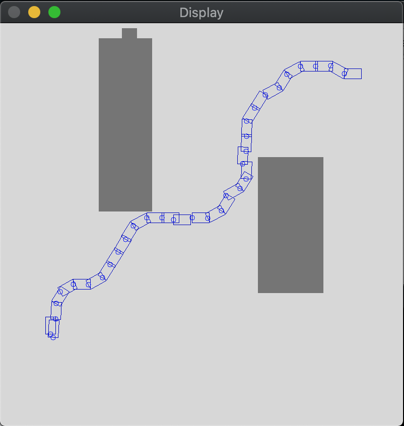

# Hybrid A* Path Planning

This project implements Hybrid-A* Path Planning algorithm for a non-holonomic vehicle, which is inspired by this [Demo Video](https://www.youtube.com/watch?time_continue=2&v=qXZt-B7iUyw).

The Hybrid-A* algorithm is described here, [Practical Search Techniques in Path Planning for Autonomous Driving](https://ai.stanford.edu/~ddolgov/papers/dolgov_gpp_stair08.pdf).

The code is ready to run a real Autonomous Vehicle with minor modifications, although it runs standalone as a demo in this repository.

## File Structure

```
.
├── CMakeLists.txt
├── README.md
├── data
│   ├── map1.png
│   ├── map2.png
│   └── map3.png
├── include
│   ├── algorithm.h
│   ├── gui.h
│   ├── map.h
│   ├── state.h
│   └── utils.h
└── src
    ├── algorithm.cpp
    ├── gui.cpp
    ├── main.cpp
    ├── map.cpp
    └── state.cpp
```

## Instruction

1) Build

```
mkdir build && cd build
cmake ..
make
```

2) Run

```
./hybrid_astar
```

3) Expected output

For a given map which is picked from those in /data folder, a given initial pose and a goal pose for the vehicle, the program is to generate a drivable path linking the initial to the goal.

In the terminal, a sequence of lines will be printed to show the running status until a final message is printed as in the following,

```
Obstacle present inside box
Obstacle present inside box
Obstacle present inside box
Obstacle present inside box
Obstacle present inside box
Obstacle present inside box
Reached goal.
```

After that, a new window will appear and display the generated path as a sequence of rectangles from the goal to the initial as in the following,



## Rubric Points

### 1. The project reads data from a file and process the data, or the program writes data to a file.

In line 14 in ./src/main.cpp, we pass a path name to the map instance.

```
Map map("../data/map1.png");
```

In line 16 - 17 in ./src/map.cpp, the Map class will load the given map as a matrix using OpenCV as below,

```
// Load the map using OpenCV as a gray image.
cv::Mat obsmap = cv::imread(map_file, 0);
```

### 2. The project uses Object Oriented Programming techniques.

For example, the program constructs the collected algorithms as a class, Algorithm, in ./include/algorithm.h and ./src/algorithm.cpp.

And Gui, Map, State, etc.

### 3. Classes use appropriate access specifiers for class members.

For example, in ./include/gui.h, we set some method functions as public and some variables as private.

### 4. Classes abstract implementation details from their interfaces.

The method ``Algorithm::hybridAstarPlanning()`` is a public method function in Algorithm class, which users car access it as an interface.

### 5. Classes encapsulate behavior.

The method ``Algorithm::astarPlanning()`` is a private method function in Algorithm class.

### 6. The project makes use of references in function declarations.

In line 49 - 60 in algorithm.cpp, the arguments of the overloaded operator "()" are passed by references.

```
/**
 * 2d coordinate comparator
 *
 * Will be used in the heap.
 */
struct Compare2d {
  bool operator()(const State &a, const State &b) {
    // return a.cost2d > b.cost2d;	//simple dijkstra
    return a.cost2d + abs(Algorithm::goal.dx - a.dx) + abs(Algorithm::goal.dy - a.dy) >
           b.cost2d + abs(Algorithm::goal.dx - b.dx) + abs(Algorithm::goal.dy - b.dy);
  }
};
```

## Algorithm Description

* A 3D discrete search space is used but unlike traditional A*, hybrid-A* associates with each grid cell a continuous 3D state of the vehicle. The resulting path is guaranteed to be drivable (standard A* can only produce piece-wise linear paths).
* The search algorithm is guided by two heuristics -
	* 'non-holonomic-without-obstacles' uses Dubin's path length ignoring obstacles
	* 'holonomic-with-obstacles' uses shortest path in 2D computed using dijkstra ignoring holonomic constraints of vehicle
* To improve search speed, the algorithm analytically expands nodes closer to goal using dubins path and checks it for collision with current obstacle map.

## Parameters

- map
- initial
- goal
- velocity

## Resources

* [Practical Search Techniques in Path Planning for Autonomous Driving](https://ai.stanford.edu/~ddolgov/papers/dolgov_gpp_stair08.pdf)
